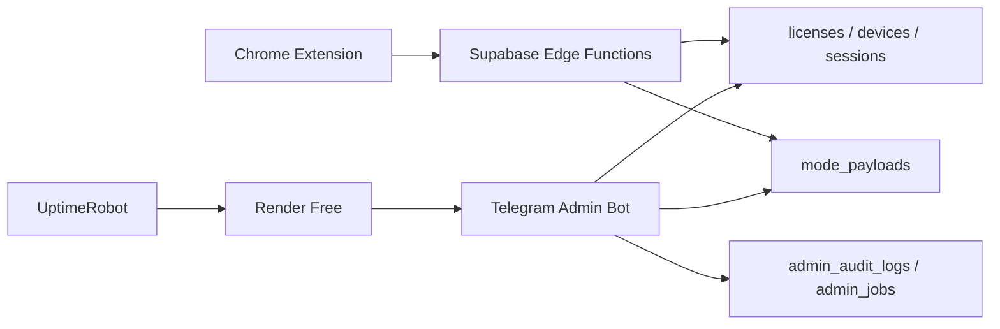

<div align="center">
  
  <h1>Arbor Sync</h1>
  <p><strong>Premium remote-session extension stack for controlled browser access, Telegram administration, and Supabase-backed payload delivery.</strong></p>
</div>

<div align="center">


</div>

---

## Overview

Arbor Sync is a controlled-access browser extension platform designed around short-lived remote sessions.

It combines:

- a Chrome extension that requests ephemeral access bundles
- Supabase Edge Functions and database tables for licenses, devices, sessions, and payload versions
- an admin-only Telegram bot for operational control from anywhere

The result is a cleaner commercial flow:

- payloads are not shipped as runtime assets inside the extension
- access can be revoked centrally
- license state, devices, and payload versions live in one source of truth
- admin actions can be performed from Telegram without opening the local project

## Architecture



## What Is Included

### Extension

- remote `session-start`, `payload-fetch`, `session-heartbeat`, `session-end`
- cookie/proxy lifecycle management
- no automatic startup injection
- session cleanup and controlled browser state restoration

### Admin bot

- dashboard summary
- license creation, lookup, renewal, revocation, reactivation
- device inspection and revocation
- payload upload from Telegram for `gpt` and `perplexity`
- payload version activation / rollback
- future-script placeholders with persistent catalog in Supabase

### Backend

- Supabase migrations for remote session core
- admin audit log and job tables
- encrypted payload storage

## Project Structure

```text
src/                     Extension runtime
supabase/                Migrations and Edge Functions
telegram-admin-bot/      Admin bot runtime
scripts/                 Verification and admin utilities
docs/superpowers/        Specs and implementation plans
```

## Local Development

### Requirements

- Node.js 20+
- Chrome for extension testing
- Supabase project already configured

### Install

```bash
npm install
```

### Verify extension and bot

```bash
npm run check
npm run telegram:check
```

### Run the Telegram bot locally

```bash
npm run telegram:bot
```

## Deployment

### Recommended free path

- `Render Free` for the Telegram bot process
- `UptimeRobot Free` pinging `/health` every 5 minutes

Why this path:

- no card required to get started
- supports Node web services
- enough for a small admin bot

Tradeoff:

- Render free sleeps after inactivity unless pinged
- this repo includes a health endpoint specifically for that setup

## Security Notes

- real secrets must stay out of Git
- local bot credentials belong in `telegram-admin-bot/.env`
- production secrets should be stored in Render and Supabase only
- `.gitignore` already excludes local secret files and logs

## Documentation

- Telegram bot design: `docs/superpowers/specs/2026-04-19-telegram-admin-bot-design.md`
- Telegram bot plan: `docs/superpowers/plans/2026-04-19-telegram-admin-bot.md`
- Remote session plan: `docs/superpowers/plans/2026-04-19-supabase-remote-session-extension.md`

## Status

Current repository state includes:

- working extension verification
- working bot verification
- Supabase admin job seed
- Render-ready bot runtime

---

<div align="center">
  <strong>Arbor Sync</strong><br />
  Secure session control with a cleaner commercial operating model.
</div>
